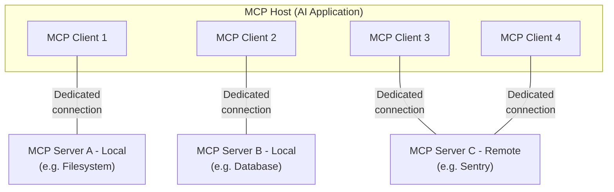

# Model Context Protocol — Specification Documentation (2026-07-28)

## Source
- Type: `web` — documentazione ufficiale della specifica MCP, versione **2026-07-28** (current secondo la pagina versioning)
- URL: https://modelcontextprotocol.io — pagine: getting-started/intro, learn/architecture, learn/server-concepts, learn/versioning (fetch 2026-09-13)
- Ingestita via: dreaming sweep 2026-09-13, a chiusura di [mcp-specification](../questions/mcp-specification.md)
- Componenti di layout Mintlify (Frame/Card/Steps/Tooltip) rimossi prima dell'ingest; testo e codice preservati

## Content

### What is the Model Context Protocol (MCP)?

MCP (Model Context Protocol) is an open-source standard for connecting AI applications to external systems.

Using MCP, AI applications like Claude or ChatGPT can connect to data sources (e.g. local files, databases), tools (e.g. search engines, calculators) and workflows (e.g. specialized prompts)—enabling them to access key information and perform tasks.

Think of MCP like a USB-C port for AI applications. Just as USB-C provides a standardized way to connect electronic devices, MCP provides a standardized way to connect AI applications to external systems.


### What can MCP enable?

* Agents can access your Google Calendar and Notion, acting as a more personalized AI assistant.
* Claude Code can generate an entire web app using a Figma design.
* Enterprise chatbots can connect to multiple databases across an organization, empowering users to analyze data using chat.
* AI models can create 3D designs on Blender and print them out using a 3D printer.

### Why does MCP matter?

Depending on where you sit in the ecosystem, MCP can have a range of benefits.

* **Developers**: MCP reduces development time and complexity when building, or integrating with, an AI application or agent.
* **AI applications or agents**: MCP gives them access to an ecosystem of data sources, tools and apps, which enhances their capabilities and improves the end-user experience.
* **End-users**: MCP results in more capable AI applications or agents that can access user data and take actions on the user's behalf when necessary.

### Broad ecosystem support

MCP is an open protocol supported across a wide range of clients and servers. AI assistants like [Claude](https://claude.com/docs/connectors/building) and [ChatGPT](https://developers.openai.com/api/docs/mcp/), development tools like [Visual Studio Code](https://code.visualstudio.com/docs/copilot/chat/mcp-servers), [Cursor](https://cursor.com/docs/context/mcp), [MCPJam](https://docs.mcpjam.com/getting-started), and many others all support MCP — making it easy to build once and integrate everywhere.

### Start Building


### Learn more

---

### Architecture overview

This overview of the Model Context Protocol (MCP) discusses its [scope](#scope) and [core concepts](#concepts-of-mcp), and provides an [example](#example) demonstrating each core concept.

Because MCP SDKs abstract away many concerns, most developers will likely find the [data layer protocol](#data-layer-protocol) section to be the most useful. It discusses how MCP servers can provide context to an AI application.

For specific implementation details, please refer to the documentation for your [language-specific SDK](https://modelcontextprotocol.io/docs/2026-07-28/sdk).

### Scope

The Model Context Protocol includes the following projects:

* [MCP Specification](https://modelcontextprotocol.io/specification/latest): A specification of MCP that outlines the implementation requirements for clients and servers.
* [MCP SDKs](https://modelcontextprotocol.io/docs/2026-07-28/sdk): SDKs for different programming languages that implement MCP.
* **MCP Development Tools**: Tools for developing MCP servers and clients, including the [MCP Inspector](https://github.com/modelcontextprotocol/inspector)
* [MCP Reference Server Implementations](https://github.com/modelcontextprotocol/servers): Reference implementations of MCP servers.

> MCP focuses solely on the protocol for context exchange—it does not dictate
  how AI applications use LLMs or manage the provided context.

### Concepts of MCP

#### Participants

MCP follows a client-server architecture where an MCP host — an AI application like [Claude Code](https://www.anthropic.com/claude-code) or [Claude Desktop](https://www.claude.ai/download) — establishes connections to one or more MCP servers. The MCP host accomplishes this by creating one MCP client for each MCP server. Each MCP client maintains a dedicated connection with its corresponding MCP server.

Local MCP servers that use the STDIO transport typically serve a single MCP client, whereas remote MCP servers that use the Streamable HTTP transport will typically serve many MCP clients.

The key participants in the MCP architecture are:

* **MCP Host**: The AI application that coordinates and manages one or multiple MCP clients
* **MCP Client**: A component that maintains a connection to an MCP server and obtains context from an MCP server for the MCP host to use
* **MCP Server**: A program that provides context to MCP clients

**For example**: Visual Studio Code acts as an MCP host. When Visual Studio Code establishes a connection to an MCP server, such as the [Sentry MCP server](https://docs.sentry.io/product/sentry-mcp/), the Visual Studio Code runtime instantiates an MCP client object that maintains the connection to the Sentry MCP server.
When Visual Studio Code subsequently connects to another MCP server, such as the [local filesystem server](https://github.com/modelcontextprotocol/servers/tree/main/src/filesystem), the Visual Studio Code runtime instantiates an additional MCP client object to maintain this connection.



Note that **MCP server** refers to the program that serves context data, regardless of
where it runs. MCP servers can execute locally or remotely. For example, when
Claude Desktop launches the [filesystem
server](https://github.com/modelcontextprotocol/servers/tree/main/src/filesystem),
the server runs locally on the same machine because it uses the STDIO
transport. This is commonly referred to as a "local" MCP server. The official
[Sentry MCP server](https://docs.sentry.io/product/sentry-mcp/) runs on the
Sentry platform, and uses the Streamable HTTP transport. This is commonly
referred to as a "remote" MCP server.

#### Layers

MCP consists of two layers:

* **Data layer**: Defines the JSON-RPC based protocol for client-server communication, including capability and version discovery, and core primitives, such as tools, resources, prompts and notifications.
* **Transport layer**: Defines the communication mechanisms and channels that enable data exchange between clients and servers, including transport-specific connection establishment, message framing, and authorization.

Conceptually the data layer is the inner layer, while the transport layer is the outer layer.

##### Data layer

The data layer implements a [JSON-RPC 2.0](https://www.jsonrpc.org/) based exchange protocol that defines the message structure and semantics.
This layer includes:

* **Discovery**: Lets clients query a server's supported protocol versions, capabilities, and identity through the `server/discover` request
* **Server features**: Enables servers to provide core functionality including tools for AI actions, resources for context data, and prompts for interaction templates from and to the client
* **Client features**: Enables servers to elicit input from the user. Sampling is [deprecated](https://modelcontextprotocol.io/specification/2026-07-28/deprecated) as of protocol version `2026-07-28`.
* **Utility features**: Supports additional capabilities like notifications for real-time updates and progress tracking for long-running operations

##### Transport layer

The transport layer manages communication channels and authentication between clients and servers. It handles connection establishment, message framing, and secure communication between MCP participants.

MCP supports two transport mechanisms:

* **Stdio transport**: Uses standard input/output streams for direct process communication between local processes on the same machine, providing optimal performance with no network overhead.
* **Streamable HTTP transport**: Uses HTTP POST for client-to-server messages with optional Server-Sent Events for streaming capabilities. This transport enables remote server communication and supports standard HTTP authentication methods including bearer tokens, API keys, and custom headers. MCP recommends using OAuth to obtain authentication tokens.

The transport layer abstracts communication details from the protocol layer, enabling the same JSON-RPC 2.0 message format across all transport mechanisms.

#### Data Layer Protocol

A core part of MCP is defining the schema and semantics between MCP clients and MCP servers. Developers will likely find the data layer — in particular, the set of [primitives](#primitives) — to be the most interesting part of MCP. It is the part of MCP that defines the ways developers can share context from MCP servers to MCP clients.

MCP uses [JSON-RPC 2.0](https://www.jsonrpc.org/) as its underlying RPC protocol. Client and servers send requests to each other and respond accordingly. Notifications can be used when no response is required.

##### Statelessness and discovery

MCP is a stateless protocol. Every request carries the protocol version and the capabilities relevant to that request in its `_meta` field, so the server can process each request on its own. Clients should also identify themselves in the same field unless configured not to. Servers advertise their supported versions and capabilities through the mandatory [`server/discover`](https://modelcontextprotocol.io/specification/2026-07-28/server/discover) request, which clients may send before any other request. Detailed information can be found in the [specification](https://modelcontextprotocol.io/specification/2026-07-28/basic/index#statelessness), and the [example](#example) showcases the per-request metadata and the discovery sequence.

##### Primitives

MCP primitives are the most important concept within MCP. They define what clients and servers can offer each other. These primitives specify the types of contextual information that can be shared with AI applications and the range of actions that can be performed.

MCP defines three core primitives that *servers* can expose:

* **Tools**: Executable functions that AI applications can invoke to perform actions (e.g., file operations, API calls, database queries)
* **Resources**: Data sources that provide contextual information to AI applications (e.g., file contents, database records, API responses)
* **Prompts**: Reusable templates that help structure interactions with language models (e.g., system prompts, few-shot examples)

Each primitive type has associated methods for discovery (`*/list`), retrieval (`*/get`), and in some cases, execution (`tools/call`).
MCP clients will use the `*/list` methods to discover available primitives. For example, a client can first list all available tools (`tools/list`) and then execute them. This design allows listings to be dynamic.

As a concrete example, consider an MCP server that provides context about a database. It can expose tools for querying the database, a resource that contains the schema of the database, and a prompt that includes few-shot examples for interacting with the tools.

For more details about server primitives see [server concepts](https://modelcontextprotocol.io/docs/server-concepts).

MCP also defines primitives that *clients* can expose. These primitives allow MCP server authors to build richer interactions.

* **Elicitation**: Allows servers to request additional information from users. This is useful when server authors want to get more information from the user, or ask for confirmation of an action. Servers request user input with the `elicitation/create` method.

Elicitation requests are delivered through the [Multi Round-Trip Requests](https://modelcontextprotocol.io/specification/2026-07-28/basic/patterns/mrtr) pattern, explained in the [elicitation overview](https://modelcontextprotocol.io/docs/2026-07-28/learn/client-concepts#elicitation).

**Deprecated**: The following client primitives are deprecated as of protocol version `2026-07-28`.

* **Sampling**: Allows servers to request language model completions from the client's AI application. This is useful when server authors want access to a language model, but want to stay model-independent and not include a language model SDK in their MCP server. Servers request completions with the `sampling/createMessage` method, also delivered through the Multi Round-Trip Requests pattern. New implementations should integrate directly with LLM provider APIs.
* **Logging**: Enables servers to send log messages to clients for debugging and monitoring purposes. New implementations should log to `stderr` (stdio transport) or use OpenTelemetry.

For more details about client primitives see [client concepts](https://modelcontextprotocol.io/docs/client-concepts).

Besides server and client primitives, the protocol supports optional [extensions](https://modelcontextprotocol.io/extensions/overview) that build on the core protocol. For example, the [Tasks extension](https://modelcontextprotocol.io/extensions/tasks/overview) lets servers return a durable handle for long-running requests, so clients can poll for status and retrieve the result later.

##### Notifications

The protocol supports real-time notifications to enable dynamic updates between servers and clients. For example, when a server's available tools change (such as when new functionality becomes available or existing tools are modified), the server can send tool update notifications to inform connected clients about these changes. Notifications are sent as JSON-RPC 2.0 notification messages (without expecting a response). Change notifications are opt-in: the client opens a long-lived [`subscriptions/listen`](https://modelcontextprotocol.io/specification/2026-07-28/basic/patterns/subscriptions) stream naming the notification types it wants to receive, and the server delivers matching notifications on that stream.

### Example

#### Data Layer

This section provides a step-by-step walkthrough of an MCP client-server interaction, focusing on the data layer protocol. We'll demonstrate discovery, tool operations, and notifications using JSON-RPC 2.0 messages.


  **Discovery**


    As described in the [statelessness and discovery](#statelessness-and-discovery) section, every MCP request carries the protocol version and client capabilities in its `_meta` field, and clients should also include their identity there. A client that wants to learn what a server supports before issuing other requests sends a `server/discover` request, which every server must implement. The discovery response is typically cacheable, meaning it can be re-used so the discovery flow does not need to be performed for every request.

    <CodeGroup>
      ```json Discover Request theme={null}
      {
        "jsonrpc": "2.0",
        "id": 1,
        "method": "server/discover",
        "params": {
          "_meta": {
            "io.modelcontextprotocol/protocolVersion": "2026-07-28",
            "io.modelcontextprotocol/clientInfo": {
              "name": "example-client",
              "version": "1.0.0"
            },
            "io.modelcontextprotocol/clientCapabilities": {
              "elicitation": {}
            }
          }
        }
      }
      ```

      ```json Discover Response theme={null}
      {
        "jsonrpc": "2.0",
        "id": 1,
        "result": {
          "resultType": "complete",
          "supportedVersions": ["2026-07-28"],
          "capabilities": {
            "tools": {
              "listChanged": true
            },
            "resources": {}
          },
          "_meta": {
            "io.modelcontextprotocol/serverInfo": {
              "name": "example-server",
              "version": "1.0.0"
            }
          },
          "ttlMs": 3600000,
          "cacheScope": "public"
        }
      }
      ```
    </CodeGroup>

    #### Understanding the Discovery Exchange

    The `_meta` fields and the discovery response together serve several purposes:

    1. **Protocol Version Selection**: The `io.modelcontextprotocol/protocolVersion` field declares the version the client is speaking on this request, and `supportedVersions` in the response lists the versions the server accepts. If a server does not support the requested version, it rejects the request with an `UnsupportedProtocolVersionError` listing the versions it does support, and the client retries with a mutually supported version.

    2. **Capability Discovery**: The client declares its capabilities in `io.modelcontextprotocol/clientCapabilities` on every request, and the server returns its own `capabilities` object from `server/discover`. This tells each party which [primitives](#primitives) the other can handle (tools, resources, prompts) and whether change [notifications](#notifications) are available, so unsupported operations are never attempted.

    3. **Identity Exchange**: The `io.modelcontextprotocol/clientInfo` field in the request's `_meta` and the `io.modelcontextprotocol/serverInfo` field in the result's `_meta` provide identification and versioning information for debugging and compatibility purposes.

    In this example, the exchange demonstrates how MCP capabilities are declared:

    **Client Capabilities**:

    * `"elicitation": {}` - The client declares it can gather additional input from the user when the server requests it

    **Server Capabilities**:

    * `"tools": {"listChanged": true}` - The server supports the tools primitive and can honor a `toolsListChanged` filter in [`subscriptions/listen`](https://modelcontextprotocol.io/specification/2026-07-28/basic/patterns/subscriptions). Clients that request this filter receive `notifications/tools/list_changed` when the tool list changes.
    * `"resources": {}` - The server also supports the resources primitive (can handle `resources/list` and `resources/read` methods)

    Calling `server/discover` is optional. Because every request carries the same `_meta` fields, a client is free to send any request directly and handle a version error if one comes back. Discovery is a convenient way to fetch the server's identity, capabilities, and supported versions in a single request.

    #### How This Works in AI Applications

    The AI application's MCP client manager connects to configured servers and stores their discovered capabilities for later use. The application uses this information to determine which servers can provide specific types of functionality (tools, resources, prompts) and whether they support real-time updates. In the Python SDK, discovery happens while the client connects. The results are then available on the client object.

    ```python Pseudo-code for AI application discovery theme={null}
    # Pseudo Code
    async with Client(stdio_client(server_config)) as client:
        if client.server_capabilities.tools:
            app.register_mcp_server(client, supports_tools=True)
        app.set_server_ready(client)
    ```
  


  **Tool Discovery (Primitives)**


    The client can discover available tools by sending a `tools/list` request. This request is fundamental to MCP's tool discovery mechanism: it allows clients to understand what tools are available on the server before attempting to use them.

    <CodeGroup>
      ```json Tools List Request theme={null}
      {
        "jsonrpc": "2.0",
        "id": 2,
        "method": "tools/list",
        "params": {
          "_meta": {
            "io.modelcontextprotocol/protocolVersion": "2026-07-28",
            "io.modelcontextprotocol/clientInfo": {
              "name": "example-client",
              "version": "1.0.0"
            },
            "io.modelcontextprotocol/clientCapabilities": {
              "elicitation": {}
            }
          }
        }
      }
      ```

      ```json Tools List Response theme={null}
      {
        "jsonrpc": "2.0",
        "id": 2,
        "result": {
          "resultType": "complete",
          "tools": [
            {
              "name": "calculator_arithmetic",
              "title": "Calculator",
              "description": "Perform mathematical calculations including basic arithmetic, trigonometric functions, and algebraic operations",
              "inputSchema": {
                "type": "object",
                "properties": {
                  "expression": {
                    "type": "string",
                    "description": "Mathematical expression to evaluate (e.g., '2 + 3 * 4', 'sin(30)', 'sqrt(16)')"
                  }
                },
                "required": ["expression"]
              }
            },
            {
              "name": "weather_current",
              "title": "Weather Information",
              "description": "Get current weather information for any location worldwide",
              "inputSchema": {
                "type": "object",
                "properties": {
                  "location": {
                    "type": "string",
                    "description": "City name, address, or coordinates (latitude,longitude)"
                  },
                  "units": {
                    "type": "string",
                    "enum": ["metric", "imperial", "kelvin"],
                    "description": "Temperature units to use in response",
                    "default": "metric"
                  }
                },
                "required": ["location"]
              }
            }
          ],
          "ttlMs": 300000,
          "cacheScope": "public"
        }
      }
      ```
    </CodeGroup>

    #### Understanding the Tool Discovery Request

    The `tools/list` request requires no parameters beyond the standard `_meta` fields that accompany every MCP request. It also accepts an optional `cursor` parameter for [pagination](https://modelcontextprotocol.io/specification/2026-07-28/server/utilities/pagination), which the example above omits.

    #### Understanding the Tool Discovery Response

    The response contains a `tools` array that provides comprehensive metadata about each available tool. This array-based structure allows servers to expose multiple tools simultaneously while maintaining clear boundaries between different functionalities.

    Each tool object in the response includes several key fields:

    * **`name`**: A unique identifier for the tool within the server's namespace. This serves as the primary key for tool execution and should follow a clear naming pattern (e.g., `calculator_arithmetic` rather than just `calculate`)
    * **`title`**: A human-readable display name for the tool that clients can show to users
    * **`description`**: Detailed explanation of what the tool does and when to use it
    * **`inputSchema`**: A JSON Schema that defines the expected input parameters, enabling type validation and providing clear documentation about required and optional parameters

    The result is marked `"resultType": "complete"` and carries two caching fields. `ttlMs` is a freshness hint in milliseconds, so this tool list can be cached for five minutes. `cacheScope` indicates who may reuse the response. The specification's [caching utility](https://modelcontextprotocol.io/specification/2026-07-28/server/utilities/caching) defines the full rules.

    #### How This Works in AI Applications

    The AI application fetches available tools from all connected MCP servers and combines them into a unified tool registry that the language model can access. This allows the LLM to understand what actions it can perform and automatically generates the appropriate tool calls during conversations.

    ```python Pseudo-code for AI application tool discovery theme={null}
    # Pseudo-code using MCP Python SDK patterns
    available_tools = []
    for client in app.mcp_clients():
        tools_response = await client.list_tools()
        available_tools.extend(tools_response.tools)
    conversation.register_available_tools(available_tools)
    ```

    Clients that federate many servers can use [progressive tool discovery](https://modelcontextprotocol.io/docs/2026-07-28/develop/clients/client-best-practices#progressive-tool-discovery) rather than loading every tool upfront.
  


  **Tool Execution (Primitives)**


    The client can now execute a tool using the `tools/call` method. This demonstrates how MCP primitives are used in practice: after discovering available tools, the client can invoke them with appropriate arguments.

    #### Understanding the Tool Execution Request

    The `tools/call` request follows a structured format that ensures type safety and clear communication between client and server. Note that we're using the proper tool name from the discovery response (`weather_current`) rather than a simplified name:

    <CodeGroup>
      ```json Tool Call Request theme={null}
      {
        "jsonrpc": "2.0",
        "id": 3,
        "method": "tools/call",
        "params": {
          "name": "weather_current",
          "arguments": {
            "location": "San Francisco",
            "units": "imperial"
          },
          "_meta": {
            "io.modelcontextprotocol/protocolVersion": "2026-07-28",
            "io.modelcontextprotocol/clientInfo": {
              "name": "example-client",
              "version": "1.0.0"
            },
            "io.modelcontextprotocol/clientCapabilities": {
              "elicitation": {}
            }
          }
        }
      }
      ```

      ```json Tool Call Response theme={null}
      {
        "jsonrpc": "2.0",
        "id": 3,
        "result": {
          "resultType": "complete",
          "content": [
            {
              "type": "text",
              "text": "Current weather in San Francisco: 68°F, partly cloudy with light winds from the west at 8 mph. Humidity: 65%"
            }
          ]
        }
      }
      ```
    </CodeGroup>

    #### Key Elements of Tool Execution

    The request structure includes several important components:

    1. **`name`**: Must match exactly the tool name from the discovery response (`weather_current`). This ensures the server can correctly identify which tool to execute.

    2. **`arguments`**: Contains the input parameters as defined by the tool's `inputSchema`. In this example:
       * `location`: "San Francisco" (required parameter)
       * `units`: "imperial" (optional parameter, defaults to "metric" if not specified)

    3. **`_meta`**: Carries the standard per-request fields: the protocol version and client capabilities that every MCP request must include, plus the client's identity, which clients should include unless configured not to.

    4. **JSON-RPC Structure**: Uses standard JSON-RPC 2.0 format with unique `id` for request-response correlation.

    #### Understanding the Tool Execution Response

    The response demonstrates MCP's flexible content system:

    1. **`content` Array**: Tool responses return an array of content objects, allowing for rich, multi-format responses (text, images, resources, etc.)

    2. **Content Types**: Each content object has a `type` field. In this example, `"type": "text"` indicates plain text content, but MCP supports various content types for different use cases.

    3. **Structured Output**: The response provides actionable information that the AI application can use as context for language model interactions.

    This execution pattern allows AI applications to dynamically invoke server functionality and receive structured responses that can be integrated into conversations with language models.

    #### How This Works in AI Applications

    When the language model decides to use a tool during a conversation, the AI application intercepts the tool call, routes it to the appropriate MCP server, executes it, and returns the results back to the LLM as part of the conversation flow. This enables the LLM to access real-time data and perform actions in the external world.

    ```python theme={null}
    # Pseudo-code for AI application tool execution
    async def handle_tool_call(conversation, tool_name, arguments):
        client = app.find_mcp_client_for_tool(tool_name)
        result = await client.call_tool(tool_name, arguments)
        conversation.add_tool_result(result.content)
    ```
  


  **Real-time Updates (Notifications)**


    MCP supports real-time notifications that enable servers to inform clients about changes without being polled for them. This demonstrates the notification system, a key feature that keeps clients synchronized and responsive.

    #### Subscribing to Changes

    Change notifications are opt-in. To receive them, the client opens a long-lived notification stream by sending a [`subscriptions/listen`](https://modelcontextprotocol.io/specification/2026-07-28/basic/patterns/subscriptions) request with a `notifications` filter naming the event types it wants. Here the client asks for tool list changes:

    ```json Listen Request theme={null}
    {
      "jsonrpc": "2.0",
      "id": 4,
      "method": "subscriptions/listen",
      "params": {
        "_meta": {
          "io.modelcontextprotocol/protocolVersion": "2026-07-28",
          "io.modelcontextprotocol/clientInfo": {
            "name": "example-client",
            "version": "1.0.0"
          },
          "io.modelcontextprotocol/clientCapabilities": {
            "elicitation": {}
          }
        },
        "notifications": {
          "toolsListChanged": true
        }
      }
    }
    ```

    Every client request carries the `io.modelcontextprotocol/protocolVersion` and `io.modelcontextprotocol/clientCapabilities` fields in `_meta`, and normally `io.modelcontextprotocol/clientInfo` as well, so the server can identify the client without relying on connection state.

    The server acknowledges the subscription with `notifications/subscriptions/acknowledged`, which is the first message carrying that subscription's ID in `_meta` (the server sends no other notification for that subscription before it). Its `notifications` field reflects the subset of the requested filter the server agreed to honor, with unsupported notification types omitted:

    ```json Acknowledgment theme={null}
    {
      "jsonrpc": "2.0",
      "method": "notifications/subscriptions/acknowledged",
      "params": {
        "_meta": {
          "io.modelcontextprotocol/subscriptionId": 4
        },
        "notifications": {
          "toolsListChanged": true
        }
      }
    }
    ```

    #### Understanding Tool List Change Notifications

    After the acknowledgment, when the server's available tools change (for example, when new functionality becomes available, existing tools are modified, or tools become temporarily unavailable), the server delivers a notification on that stream:

    ```json Notification theme={null}
    {
      "jsonrpc": "2.0",
      "method": "notifications/tools/list_changed",
      "params": {
        "_meta": {
          "io.modelcontextprotocol/subscriptionId": 4
        }
      }
    }
    ```

    #### Key Features of MCP Notifications

    1. **No Response Required**: Notice there's no `id` field in the notification. This follows JSON-RPC 2.0 notification semantics where no response is expected or sent.

    2. **Opt-In Based**: This notification is only sent to clients that requested `"toolsListChanged": true` in their `subscriptions/listen` filter, and it is only available from servers that declared `"listChanged": true` in their tools capability (as shown in Step 1).

    3. **Subscription-ID Tagging**: Every notification on the stream carries `io.modelcontextprotocol/subscriptionId` in `_meta`. The value is the JSON-RPC ID of the `subscriptions/listen` request that opened the stream (`4` in this example), so clients can correlate each notification with the subscription that produced it.

    4. **Event-Driven**: The server decides when to send notifications based on internal state changes, making MCP connections dynamic and responsive.

    5. **Best Effort**: There are no guarantees that every notification will be sent or received, particularly across transport reconnects. Clients should also rely on polling to preserve freshness of results.

    #### Client Response to Notifications

    Upon receiving this notification, the client typically reacts by requesting the updated tool list. This creates a refresh cycle that keeps the client's understanding of available tools current:

    ```json Request theme={null}
    {
      "jsonrpc": "2.0",
      "id": 5,
      "method": "tools/list",
      "params": {
        "_meta": {
          "io.modelcontextprotocol/protocolVersion": "2026-07-28",
          "io.modelcontextprotocol/clientInfo": {
            "name": "example-client",
            "version": "1.0.0"
          },
          "io.modelcontextprotocol/clientCapabilities": {
            "elicitation": {}
          }
        }
      }
    }
    ```

    #### Why Notifications Matter

    This notification system is crucial for several reasons:

    1. **Dynamic Environments**: Tools may come and go based on server state, external dependencies, or user permissions
    2. **Efficiency**: Clients don't need to poll for changes; they're notified when updates occur
    3. **Consistency**: Ensures clients always have accurate information about available server capabilities
    4. **Real-time Collaboration**: Enables responsive AI applications that can adapt to changing contexts

    This notification pattern extends beyond tools to other MCP primitives, enabling comprehensive real-time synchronization between clients and servers.

    #### How This Works in AI Applications

    The AI application keeps a notification stream open for the changes it cares about. When one arrives, it immediately refreshes its tool registry and updates the LLM's available capabilities. This ensures that ongoing conversations always have access to the most current set of tools, and the LLM can dynamically adapt to new functionality as it becomes available.

    ```python theme={null}
    # Pseudo-code for AI application notification handling
    async def follow_tool_changes(client):
        async with client.listen(tools_list_changed=True) as sub:
            async for _event in sub:
                tools_response = await client.list_tools()
                app.update_available_tools(client, tools_response.tools)
                if app.conversation.is_active():
                    app.conversation.notify_llm_of_new_capabilities()
    ```

---

### Understanding MCP servers

MCP servers are programs that expose specific capabilities to AI applications through standardized protocol interfaces.

Common examples include file system servers for document access, database servers for data queries, GitHub servers for code management, Slack servers for team communication, and calendar servers for scheduling.

### Core Server Features

Servers provide functionality through three building blocks:

| Feature       | Explanation                                                                                                                                                                             | Examples                                                           | Who controls it |
| ------------- | --------------------------------------------------------------------------------------------------------------------------------------------------------------------------------------- | ------------------------------------------------------------------ | --------------- |
| **Tools**     | Functions that your LLM can actively call, and decides when to use them based on user requests. Tools can write to databases, call external APIs, modify files, or trigger other logic. | Search flights<br />Send messages<br />Create calendar events      | Model           |
| **Resources** | Passive data sources that provide read-only access to information for context, such as file contents, database schemas, or API documentation.                                           | Retrieve documents<br />Access knowledge bases<br />Read calendars | Application     |
| **Prompts**   | Pre-built instruction templates that tell the model to work with specific tools and resources.                                                                                          | Plan a vacation<br />Summarize my meetings<br />Draft an email     | User            |

We will use a hypothetical scenario to demonstrate the role of each of these features, and show how they can work together.

#### Tools

Tools enable AI models to perform actions. Each tool defines a specific operation with typed inputs and outputs. The model requests tool execution based on context.

##### How Tools Work

Tools are schema-defined interfaces that LLMs can invoke. MCP uses JSON Schema for validation. Each tool performs a single operation with clearly defined inputs and outputs. Tools may require user consent prior to execution, helping to ensure users maintain control over actions taken by a model.

**Protocol operations:**

| Method       | Purpose                  | Returns                                |
| ------------ | ------------------------ | -------------------------------------- |
| `tools/list` | Discover available tools | Array of tool definitions with schemas |
| `tools/call` | Execute a specific tool  | Tool execution result                  |

**Example tool definition:**

```typescript theme={null}
{
  name: "searchFlights",
  description: "Search for available flights",
  inputSchema: {
    type: "object",
    properties: {
      origin: { type: "string", description: "Departure city" },
      destination: { type: "string", description: "Arrival city" },
      date: { type: "string", format: "date", description: "Travel date" }
    },
    required: ["origin", "destination", "date"]
  }
}
```

##### Example: Travel Booking

Tools enable AI applications to perform actions on behalf of users. In a travel planning scenario, the AI application might use several tools to help book a vacation:

**Flight Search**

```
searchFlights(origin: "NYC", destination: "Barcelona", date: "2024-06-15")
```

Queries multiple airlines and returns structured flight options.

**Calendar Blocking**

```
createCalendarEvent(title: "Barcelona Trip", startDate: "2024-06-15", endDate: "2024-06-22")
```

Marks the travel dates in the user's calendar.

**Email notification**

```
sendEmail(to: "team@work.com", subject: "Out of Office", body: "...")
```

Sends an automated out-of-office message to colleagues.

##### User Interaction Model

Tools are model-controlled, meaning AI models can discover and invoke them automatically. However, MCP emphasizes human oversight through several mechanisms.

For trust and safety, applications can implement user control through various mechanisms, such as:

* Displaying available tools in the UI, enabling users to define whether a tool should be made available in specific interactions
* Approval dialogs for individual tool executions
* Permission settings for pre-approving certain safe operations
* Activity logs that show all tool executions with their results

#### Resources

Resources provide structured access to information that the AI application can retrieve and provide to models as context.

##### How Resources Work

Resources expose data from files, APIs, databases, or any other source that an AI needs to understand context. Applications can access this information directly and decide how to use it - whether that's selecting relevant portions, searching with embeddings, or passing it all to the model.

Each resource has a unique URI (e.g., `file:///path/to/document.md`) and declares its MIME type for appropriate content handling.

Resources support two discovery patterns:

* **Direct Resources** - fixed URIs that point to specific data. Example: `calendar://events/2024` - returns calendar availability for 2024
* **Resource Templates** - dynamic URIs with parameters for flexible queries. Example:
  * `travel://activities/{city}/{category}` - returns activities by city and category
  * `travel://activities/barcelona/museums` - returns all museums in Barcelona

Resource Templates include metadata such as title, description, and expected MIME type, making them discoverable and self-documenting.

**Protocol operations:**

| Method                     | Purpose                         | Returns                                |
| -------------------------- | ------------------------------- | -------------------------------------- |
| `resources/list`           | List available direct resources | Array of resource descriptors          |
| `resources/templates/list` | Discover resource templates     | Array of resource template definitions |
| `resources/read`           | Retrieve resource contents      | Resource data with metadata            |
| `subscriptions/listen`     | Monitor resource changes        | Stream of update notifications         |

To watch specific resources for changes, a client sends a [`subscriptions/listen`](https://modelcontextprotocol.io/specification/2026-07-28/basic/patterns/subscriptions) request with the resource URIs listed in the `resourceSubscriptions` filter. The server delivers `notifications/resources/updated` on the resulting stream whenever a watched resource changes.

##### Example: Getting Travel Planning Context

Continuing with the travel planning example, resources provide the AI application with access to relevant information:

* **Calendar data** (`calendar://events/2024`) - Checks user availability
* **Travel documents** (`file:///Documents/Travel/passport.pdf`) - Accesses important documents
* **Previous itineraries** (`trips://history/barcelona-2023`) - References past trips and preferences

The AI application retrieves these resources and decides how to process them, whether selecting a subset of data using embeddings or keyword search, or passing raw data directly to the model.

In this case, it provides calendar data, weather information, and travel preferences to the model, enabling it to check availability, look up weather patterns, and reference past travel preferences.

**Resource Template Examples:**

```json theme={null}
{
  "uriTemplate": "weather://forecast/{city}/{date}",
  "name": "weather-forecast",
  "title": "Weather Forecast",
  "description": "Get weather forecast for any city and date",
  "mimeType": "application/json"
}

{
  "uriTemplate": "travel://flights/{origin}/{destination}",
  "name": "flight-search",
  "title": "Flight Search",
  "description": "Search available flights between cities",
  "mimeType": "application/json"
}
```

These templates enable flexible queries. For weather data, users can access forecasts for any city/date combination. For flights, they can search routes between any two airports. When a user has input "NYC" as the `origin` airport and begins to input "Bar" as the `destination` airport, the system can suggest "Barcelona (BCN)" or "Barbados (BGI)".

##### Parameter Completion

Dynamic resources support parameter completion. For example:

* Typing "Par" as input for `weather://forecast/{city}` might suggest "Paris" or "Park City"
* Typing "JFK" for `flights://search/{airport}` might suggest "JFK - John F. Kennedy International"

The system helps discover valid values without requiring exact format knowledge.

##### User Interaction Model

Resources are application-driven, giving them flexibility in how they retrieve, process, and present available context. Common interaction patterns include:

* Tree or list views for browsing resources in familiar folder-like structures
* Search and filter interfaces for finding specific resources
* Automatic context inclusion or smart suggestions based on heuristics or AI selection
* Manual or bulk selection interfaces for including single or multiple resources

Applications are free to implement resource discovery through any interface pattern that suits their needs. The protocol doesn't mandate specific UI patterns, allowing for resource pickers with preview capabilities, smart suggestions based on current conversation context, bulk selection for including multiple resources, or integration with existing file browsers and data explorers.

#### Prompts

Prompts provide reusable templates. They allow MCP server authors to provide parameterized prompts for a domain, or showcase how to best use the MCP server.

##### How Prompts Work

Prompts are structured templates that define expected inputs and interaction patterns. They are user-controlled, requiring explicit invocation rather than automatic triggering. Prompts can be context-aware, referencing available resources and tools to create comprehensive workflows. Similar to resources, prompts support parameter completion to help users discover valid argument values.

**Protocol operations:**

| Method         | Purpose                    | Returns                               |
| -------------- | -------------------------- | ------------------------------------- |
| `prompts/list` | Discover available prompts | Array of prompt descriptors           |
| `prompts/get`  | Retrieve prompt details    | Full prompt definition with arguments |

##### Example: Streamlined Workflows

Prompts provide structured templates for common tasks. In the travel planning context:

**"Plan a vacation" prompt:**

```json theme={null}
{
  "name": "plan-vacation",
  "title": "Plan a vacation",
  "description": "Guide through vacation planning process",
  "arguments": [
    { "name": "destination", "type": "string", "required": true },
    { "name": "duration", "type": "number", "description": "days" },
    { "name": "budget", "type": "number", "required": false },
    { "name": "interests", "type": "array", "items": { "type": "string" } }
  ]
}
```

Rather than unstructured natural language input, the prompt system enables:

1. Selection of the "Plan a vacation" template
2. Structured input: Barcelona, 7 days, \$3000, \["beaches", "architecture", "food"]
3. Consistent workflow execution based on the template

##### User Interaction Model

Prompts are user-controlled, requiring explicit invocation. The protocol gives implementers freedom to design interfaces that feel natural within their application. Key principles include:

* Easy discovery of available prompts
* Clear descriptions of what each prompt does
* Natural argument input with validation
* Transparent display of the prompt's underlying template

Applications typically expose prompts through various UI patterns such as:

* Slash commands (typing "/" to see available prompts like /plan-vacation)
* Command palettes for searchable access
* Dedicated UI buttons for frequently used prompts
* Context menus that suggest relevant prompts

### Bringing Servers Together

The real power of MCP emerges when multiple servers work together, combining their specialized capabilities through a unified interface.

#### Example: Multi-Server Travel Planning

Consider a personalized AI travel planner application, with three connected servers:

* **Travel Server** - Handles flights, hotels, and itineraries
* **Weather Server** - Provides climate data and forecasts
* **Calendar/Email Server** - Manages schedules and communications

##### The Complete Flow

1. **User invokes a prompt with parameters:**

   ```json theme={null}
   {
     "prompt": "plan-vacation",
     "arguments": {
       "destination": "Barcelona",
       "departure_date": "2024-06-15",
       "return_date": "2024-06-22",
       "budget": 3000,
       "travelers": 2
     }
   }
   ```

2. **User selects resources to include:**
   * `calendar://my-calendar/June-2024` (from Calendar Server)
   * `travel://preferences/europe` (from Travel Server)
   * `travel://past-trips/Spain-2023` (from Travel Server)

3. **AI processes the request using tools:**

   The AI first reads all selected resources to gather context - identifying available dates from the calendar, learning preferred airlines and hotel types from travel preferences, and discovering previously enjoyed locations from past trips.

   Using this context, the AI then executes the prompt provided by the AI application. In our example, the AI application exposes the weather tools from the connected MCP weather server to the model. Because weather can affect travel plans, the AI chooses to call `checkWeather()` when interpreting the prompt.

   As a result the AI executes a series of tools:

   * `searchFlights()` - Queries airlines for NYC to Barcelona flights
   * `checkWeather()` - Retrieves climate forecasts for travel dates

   The AI then uses this information to create the booking and following steps, requesting approval from the user where necessary:

   * `bookHotel()` - Finds hotels within the specified budget
   * `createCalendarEvent()` - Adds the trip to the user's calendar
   * `sendEmail()` - Sends confirmation with trip details

**The result:** Through multiple MCP servers, the user researched and booked a Barcelona trip tailored to their schedule. The "Plan a Vacation" prompt guided the AI to combine Resources (calendar availability and travel history) with Tools (searching flights, booking hotels, updating calendars) across different servers—gathering context and executing the booking. A task that could have taken hours was completed in minutes using MCP.

---

### Versioning

The Model Context Protocol uses string-based version identifiers following the format
`YYYY-MM-DD`, to indicate the last date backwards incompatible changes were made.

> The protocol version will *not* be incremented when the
  protocol is updated, as long as the changes maintain backwards compatibility. This allows
  for incremental improvements while preserving interoperability.

### Revisions

Revisions may be marked as:

* **Draft**: in-progress specifications, not yet ready for consumption.
* **Current**: the current protocol version, which is ready for use and may continue to
  receive backwards compatible changes.
* **Final**: past, complete specifications that will not be changed.

The **current** protocol version is [**2026-07-28**](https://modelcontextprotocol.io/specification/2026-07-28/).

### Feature States

Individual features of the specification may additionally be marked as
**Deprecated** under the
[feature lifecycle and deprecation policy](https://modelcontextprotocol.io/community/feature-lifecycle):
the feature remains part of the specification, but is scheduled for removal.
Deprecated features document a migration path (or state that none is required)
and remain in the specification for at least twelve months, or at least
ninety days under the policy's
[expedited-removal exception](https://modelcontextprotocol.io/community/feature-lifecycle#expedited-removal),
before they become eligible for removal, after which they may be **Removed**
in a future revision.

Features that are currently Deprecated are listed in the
[deprecated features registry](https://modelcontextprotocol.io/specification/2026-07-28/deprecated).

### Negotiation

Every request declares the protocol version it is using via the
`io.modelcontextprotocol/protocolVersion` key in its
[`_meta`](https://modelcontextprotocol.io/specification/2026-07-28/basic/index#meta) field, and the server accepts or
rejects each request independently. On Streamable HTTP, the same value is also carried
in the
[`MCP-Protocol-Version` header](https://modelcontextprotocol.io/specification/2026-07-28/basic/transports/streamable-http#protocol-version-header).
Clients and servers **MAY** support multiple protocol versions simultaneously.

If the server does not support the requested version, it responds with an
[`UnsupportedProtocolVersionError`](https://modelcontextprotocol.io/specification/2026-07-28/basic/versioning#protocol-version-negotiation)
listing the versions it does support. The client can then retry the request with a
mutually supported version, or surface an error to the user if none exists.

Clients that want to select a version up front can call
[`server/discover`](https://modelcontextprotocol.io/specification/2026-07-28/server/discover), a mandatory RPC that
returns the server's supported protocol versions, capabilities, and identity in a
single request. Calling it is optional: a client is free to send any request directly
and handle a version error if one comes back.

For interoperability with servers and clients that implement the
handshake-based protocol revisions (`2025-11-25` and earlier), see
[Backward Compatibility](https://modelcontextprotocol.io/specification/2026-07-28/basic/versioning#backward-compatibility-with-initialization-based-versions).

## Notes
<!-- openclaw:human:start -->
<!-- openclaw:human:end -->

## Related
<!-- openclaw:wiki:related:start -->
- No related pages yet.
<!-- openclaw:wiki:related:end -->
